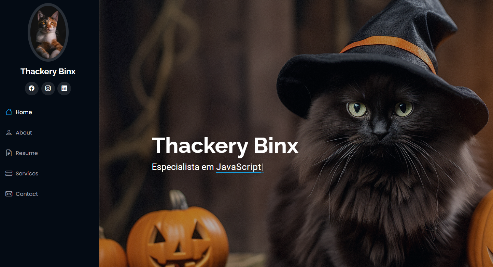

<h1 align="center"> Portfolio Pessoal </h1> 

Portfólio criado na faculdade durante as aulas de Bootstrap.

  
  <a href="#-screenshots">Screenshots</a>&nbsp;&nbsp;&nbsp;|&nbsp;&nbsp;&nbsp;
  <a href="#-information">Information</a>&nbsp;&nbsp;&nbsp;|&nbsp;&nbsp;&nbsp;
  <a href="#-technologies">Technologies</a>&nbsp;&nbsp;&nbsp;|&nbsp;&nbsp;&nbsp;
  <a href="#-features">Features</a>&nbsp;&nbsp;&nbsp;|&nbsp;&nbsp;&nbsp;
  <a href="#-project">Project</a>&nbsp;&nbsp;&nbsp;|&nbsp;&nbsp;&nbsp;
  <a href="#-license">License</a>&nbsp;&nbsp;&nbsp;|&nbsp;&nbsp;&nbsp;
  <a href="#-contributing">Contributing</a>&nbsp;&nbsp;&nbsp;|&nbsp;&nbsp;&nbsp;
  <a href="#support">Support</a>  

  

## 📸 Screenshots

 

 

 

## 📌 Information

* Baseado no Template: [iPortfolio](https://bootstrapmade.com/iportfolio-bootstrap-portfolio-websites-template/)
* Autor: [BootstrapMade](BootstrapMade.com)
* Licença: [Bootstrap Made License](https://bootstrapmade.com/license/)

 

<h2> Suggestions </h2>

 Do you want to add or report an error? Please, feel free to do it! 😉 

 

<h2> Support </h2>

 If you liked it, press the Star ⭐ Button, please! 😄 

